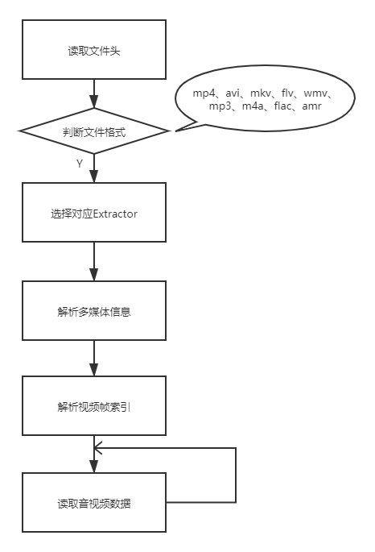

# 基础

## 概念

### 码率
码率，又叫比特率，是单位时间内视频（或音频）的数据量，单位一般为kbps(kilo bit per second)

不同的码率，决定着编码器压缩视频的程度，是决定视频最终质量和文件大小的关键因素：
- 码率越低，表示压缩程度越高，画质越差。
- 码率越高，视频质量相对越高，视频文件也就越大。

码率的分类
+ 恒定码率：CBR(constant bitrate)，以恒定比特率方式进行编码,图像变化量比较大时方块效应比较明显。

+ 动态码率：VBR(variable bitrate)，其码率可以随着图像的复杂程度的不同而变化，因此其编码效率比较高，码率波动较大，带宽要求较高，图像变化量比较大时方块效应有所改善。

+ 改进的VBR：CVBR,maximum bitrate恒定或者average bitrate恒定,兼顾了CBR和VBR的优点：在图像内容静止时，节省带宽，有运动发生时，利用前期节省的带宽来尽可能的提高图像质量，达到同时兼顾带宽和图像质量的目的。这种方法通常会让用户输入最大码率和最小码率，静止时，码率稳定在最小码率，运动时，码率大于最小码率，但是又不超过最大码率。

+ 平均码率：AVR(average bitrate)，是在CBR和VBR两者之间的一种权衡，即设定一段时间的平均码率，在此时间内，对简单，静态的图像分配低于平均码率的码率，对于复杂的，大量运动的图像分配高于平均码率的码流，适合网络传输。

### 分辨率
+ 视频分辨率：又称为图像分辨率，表示形式宽x高，常见的视频分辨率有480P、720P、1080P、2K(2048x1080/2160x1440)、4K(4096x2160/3840x2160)
+ 屏幕分辨率：又称为显示分辨率，描述屏幕分辨率的单位是ppi(pixel per inch，每英寸的像素数)。
+ 位分辨率：又称为位深(BitDepth)，每个像素点存储信息的bit数。

### 帧率
+ 视频帧率：是用于测量显示帧数的量度，单位为每秒显示帧数(FPS，frame per second)。一般视频帧率为24fps。
+ 显示帧率：以帧为单位的位图图像连续出现在显示器的频率，也称为刷新速率。刷新率一般为60Hz，也就是帧率为60fps，每帧为16ms，超过16ms能给人的肉眼带来延迟卡顿的感觉。

### 封装格式
视频的封装格式，由特定格式头+媒体信息+音视频轨(字幕)数据+视频轨索引组成。常见的封装格式有：mp4、mkv、webm、avi、3gp、mov、wmv、flv、mpeg、asf、rmvb等。

### 编码协议
视频经过解封装得到的视频轨数据，是经过编码的，所以显示视频帧前需要解码。不同编码算法组成不同编码协议，常见的有：H264(AVC，一般使用x264编码)、H265(HEVC，一般使用x265编码)等。

## 视频封装格式
视频信息都以特定格式存储在文件开头或者结尾,称为多媒体信息或者多媒体元数据。通用的封装格式由：文件标识头+多媒体信息+音视频(字幕)轨+视频帧索引块组成。

音视频的封装格式就是通过解析文件标识头进行判断的，然后解析多媒体信息从而获取时长，再解析视频帧索引块，最后根据索引块去获取对应时间戳的视频帧。

音视频封装格式存储的字段包括：时长、码率、音视频编码器、分辨率(宽x高)、帧率、像素格式、旋转角度、采样率、声道数等等。其中视频专有的字段是分辨率、帧率、像素格式、旋转角度，而音频专有的字段是采样率、声道数。

整个解封装流程：从读取文件头判断视频格式开始，然后选择对应的Extractor，解析多媒体信息，再解析视频帧的索引块，最后根据索引去定位并读取音视频数据。如下图所示：

